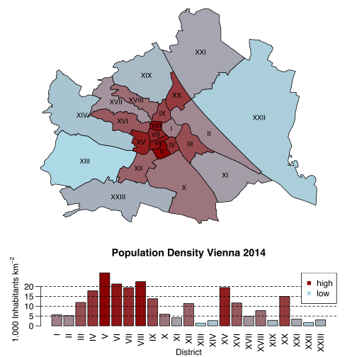

The new Github repository [OpenGovernmentVienna](https://github.com/ViennaR/OpenGovernmentVienna) has already been created including a very nice addition by Christian.

The script executes the following steps:

1. Download Vienna map including district boundaries from http://data.wien.gv.at.
2. Download population and district size from https://www.wien.gv.at/statistik, calculate population density.
3. Plot Vienna map coloured by population density.


```r
library(rgdal) 
library(rgeos) 
library(XML)
library(RCurl)

download.vienna.bydistrict <- function(tablename, skip.row = 3) {
	baseurl <- "https://www.wien.gv.at/statistik"
	popurl <- sprintf("%s/%s.html", baseurl, tablename)

	poptable <- readHTMLTable(getURL(popurl))[[1]]
	poptable <- poptable[-c(1:skip.row), ]
	poptable <- poptable[, -1]
	row.names(poptable) <- NULL
	poptable <- sapply(poptable, function(x) gsub(".", "", x, fixed = TRUE))
	poptable <- gsub(",", ".", poptable, fixed = TRUE)
	poptable <- matrix(as.numeric(poptable), nrow = nrow(poptable))
	poptable
}

# Download Data Shape Data District Boundaries
mapdata <- "http://data.wien.gv.at/daten/geo?service=WFS&request=GetFeature&version=1.1.0&typeName=ogdwien:BEZIRKSGRENZEOGD&srsName=EPSG:4326&outputFormat=shape-zip"

dir.create("data", showWarnings = FALSE)
destfile <- "data/BEZIRKSGRENZEOGD.zip"
download.file(mapdata, destfile = destfile)
unzip(destfile, exdir = "data/BEZIRKSGRENZEOGD")
file.remove(destfile)
```

```
## [1] TRUE
```

```r
# Read District Boundaries
wmap <- readOGR("data/BEZIRKSGRENZEOGD", layer="BEZIRKSGRENZEOGDPolygon") 
```

```
## OGR data source with driver: ESRI Shapefile 
## Source: "data/BEZIRKSGRENZEOGD", layer: "BEZIRKSGRENZEOGDPolygon"
## with 23 features
## It has 15 fields
```

```r
# Download Population per district
distpop <- download.vienna.bydistrict("bevoelkerung/tabellen/bevoelkerung-alter-geschl-bez")
distpopsum <- rowSums(as.matrix(distpop))

# Download Size of Each district
distsize <- download.vienna.bydistrict("lebensraum/tabellen/nutzungsklassen-bez", skip.row = 2)
distsizekm2 <- distsize[, 1] / 100

wd <- data.frame(distpopsum / distsizekm2)

centroids <- gCentroid(wmap, byid=TRUE) 
colfunc <- colorRampPalette(c("lightblue", "darkred")) 
colnames(wd) <- "inh" 
wd$district <- seq(1,23) 
anstieg_pop <- wd$district[order(wd$inh)] 
colsort <- colfunc(23)[order(anstieg_pop)] 
layout(matrix(c(1,2), byrow = TRUE),height=c(1.3, 0.7)) 
par(mar=c(0,0,0,0)) 
plot(wmap,col=colsort[wmap$BEZNR]) 
text(as.character(wmap$BEZ_RZ), x = centroids@coords[,1], y = centroids@coords[,2],cex=0.8) 
par(mar=c(3,4,4,2),mgp=c(2,0.7,0)) 
barplot(wd$inh,main="Population Density Vienna 2014",yaxt="n",col=colsort,xlab="District",beside=T, ylab=expression(paste("1.000 Inhabitants km"^-2)),names.arg=as.roman(wd$district),las=2) 
axis(2,labels=c("0","5","10","15","20"),at=c(0,5000,10000,15000,20000),las=1) 
abline(h=c(5000,10000,15000,20000),lty=2) 
legend("topright",pch=c(15,15),col=c("darkred","lightblue"),c("high","low"),bg="white") 
```

 

```r
dev.off()
```

```
## null device 
##           1
```

Authors: Christian Brandstaetter with small additions by Mario Annau
